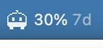

# ClaudeMeter

See how much of your Claude usage limit you've used, right in your Mac's menu bar,
and whether you're on pace to run out before it resets.



It works with whatever limits your Claude org has: a **monthly** cap, a **5-hour**
and **7-day** window, or both. It reads Claude Desktop's own local log. Nothing is
sent anywhere, and it needs no password or API key.

**Needs:** a Mac, with [Claude Desktop](https://claude.ai/download) installed and
signed in.

## Get it running

Pick one.

### Option 1: Ask Claude to set it up

If you have Claude Code (in the terminal, or the Code tab in Claude Desktop),
paste this in:

```text
Clone https://github.com/andy-watanabe/claudmeter into ~/claudmeter, read its
CLAUDE.md, and follow it to set ClaudeMeter up for me. Then explain my numbers.
```

Claude installs any missing tools, builds the app, starts it, and tells you what
your limits are and where you stand. If something goes wrong, it fixes it.

### Option 2: Download the app

1. Download [ClaudeMeter.zip](https://github.com/andy-watanabe/claudmeter/releases/latest/download/ClaudeMeter.zip)
   and double-click it to unzip.
2. Drag **ClaudeMeter** into your **Applications** folder, and open it.
3. macOS will say it can't verify the app. That's because it isn't signed by a
   paid Apple developer account, not because anything is wrong with it. Click
   **Done**, then open **System Settings → Privacy & Security**, scroll down, and
   click **Open Anyway** next to ClaudeMeter. You only do this once.
4. Click the new menu bar icon and turn on **Start at Login**.

To update, download it again and replace the old copy.

### Option 3: Homebrew or script (for developers)

```bash
brew tap andy-watanabe/claudmeter
brew install claudemeter
claudemeter &
```

Or, without Homebrew:

```bash
curl -fsSL https://raw.githubusercontent.com/andy-watanabe/claudmeter/main/install.sh | bash
```

Both build from source, which needs the Xcode Command Line Tools
(`xcode-select --install`). Re-run the script, or `brew upgrade`, to update.

**No number yet?** The menu says "No usage data yet" until Claude Desktop records
its first figure, which can take about 15 minutes. Leave Claude Desktop open.

## Reading it

The number is **percent used**. The tag next to it says which limit it is:

| Tag | Limit | Resets |
|---|---|---|
| `mo` | Monthly extra-usage cap | Start of each month |
| `5h` | 5-hour window | About 5 hours after it starts |
| `7d` | 7-day window | About 7 days after it starts |

The number turns orange at 75% and red at 90%.

**What happens at 100%?** You can't send more messages until that limit resets.
If your org has extra usage turned on, you may be able to keep going and be billed
instead. For the monthly cap, 100% means the extra spend is used up until the
month resets or an admin raises it.

**Click the icon** for more:

- **Limits:** what your org has, e.g. "Limits: 5-hour + 7-day windows (no monthly
  budget)". If it says no monthly budget, you don't have one, even if you assumed
  you did.
- Every limit's percent used.
- **Pace:** ✅ trending under, ⚠️ cutting it close, or 🔺 on pace to hit the limit
  (and roughly when). Plus your rate, and time until reset.
- **Show in Menu Bar:** if you have more than one limit, pick which one the menu
  bar shows. It defaults to the monthly cap if you have one, otherwise the 7-day
  window.
- **Animate Sprout:** Sprout, the little menu bar critter, blinks now and then and
  sometimes scratches its head. Untick this to keep it still. It also stays still
  if Reduce Motion is on in macOS accessibility settings.
- **Start at Login**, **Refresh Now**, **Quit**.

## Good to know

- **The 5-hour and 7-day labels are a best guess.** Claude Desktop logs them as
  `fh` and `sd` without saying what they are. `fh` behaves like a 5-hour window.
  `sd` has been seen resetting overnight, which doesn't fit a true 7-day window,
  so treat its reset time as rough.
- **No dollar amounts.** Your cap's dollar value isn't stored anywhere on your
  Mac, so ClaudeMeter can't show it. Claude Desktop's own usage popover, or your
  admin, has it.
- **Early in a cycle, the pace swings.** One busy morning can look like you're
  heading over. It settles as more data comes in.
- **One org at a time.** If you switch Claude orgs, ClaudeMeter follows the one
  Claude Desktop is signed into now, and shows its short ID in the menu.
- **It only updates while Claude Desktop is running.** If Claude Desktop stops
  logging, the menu bar dims and the menu says so.

## Uninstall

Turn off **Start at Login** in the menu, click **Quit**, then delete ClaudeMeter
from your Applications folder (or `~/Applications`). Homebrew: `brew uninstall
claudemeter`.

## Details

<details>
<summary>Where the data comes from</summary>

`~/Library/Application Support/Claude/plan-usage-history.json`, the log Claude
Desktop appends to every ~15 minutes. ClaudeMeter watches it and updates when it
changes, with a 60-second check as a backstop.

Most entries carry no figure; an actual percentage lands every 1–2.5 hours. So
"Claude Desktop stopped logging" and "the figure hasn't changed" are different
things:

| What's happening | What you see |
|---|---|
| Logging, figure current | Just the figure's timestamp |
| Logging, but no new figure in 4h+ | A quiet note in the menu |
| No log entry at all in 45min+ | ⚠︎ warning, and the menu bar dims |

Only the last one means something is wrong.

The log is shared across orgs; each entry carries an `org` ID. ClaudeMeter only
uses entries from the org that logged most recently, since budgets are per org.

</details>

<details>
<summary>How the pace estimate works</summary>

The rate is the higher of two: the average since the current cycle started, and
the rate over the last 3 hours. Taking the higher one means a quiet afternoon
after a heavy morning doesn't hide a real trend.

The monthly cap is assumed to reset on the calendar month. For the 5-hour and
7-day windows the reset isn't in the log, so it's estimated: the first figure
after the last drop marks the window's start, and the reset is 5h or 7d after
that. It can run late by up to one gap between figures. Once that estimated reset
passes, the menu waits for a new figure instead of projecting from a stale one.

</details>

<details>
<summary>Config</summary>

`~/.config/claude-meter/config.json`, optional:

```json
{ "cycleLengthDays": 30 }
```

Only set this if your monthly cap resets on a rolling N-day cycle rather than the
calendar month.

There's no dollar setting on purpose: the figure isn't stored locally, and
reading it would mean using Claude Desktop's login to call an undocumented API.

</details>

<details>
<summary>Check the numbers from a terminal</summary>

```bash
~/Applications/ClaudeMeter.app/Contents/MacOS/ClaudeMeter --dump
```

Prints every meter, the pace math, and the projected reset.

</details>

<details>
<summary>Building and releasing</summary>

See [CLAUDE.md](CLAUDE.md) for build, test, and release steps.

</details>
